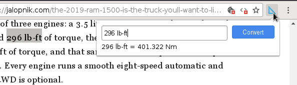

# Metric conversion

A Chrome extension to convert US/UK units to their metric equivalents. Just to make life easier for the rest of the World. The conversion is only one-way: to metric. It is for didactical purposes (to get rid of this nuisance)

## License

[GPLv2](https://en.wikipedia.org/wiki/GNU_General_Public_License#Version_2)

## Documentation

Clone the repo and add the `extensions` dir into your Chromium's extensions in Developer mode. The extension should appear on the top (next to the Omnibar). Click on it, enter the value and unit to convert and hit Enter. Alternatively you can also select some text on the page and then click the icon: the text will be filled out for you. See the animation above to get an idea.

The unit-library is not exhaustive: I tried to cover the most used cases. Feel free to add yours. Ideas for improvements are also welcome.

The metric.ts lib is doing most of the conversion, the rest of the files are part of the extension.

## Installation

`git pull` the repository then `npm install` and `npm run-script build`. The `extension` dir is where all the output files required for running the extension are located.

I highly recommend using `pnpm` over vanilla `npm` or `yarn` to manage disk space better: typescript and webpack eat up a lot of real estate, otherwise the extension has no dependencies.

## Credits where credits due

- The unit conversion multipliers / formulas were compiled using DuckDuckGo's converter and Wikipedia
- The UI of the converter was shamelesly stolen from Google's dictionary extension to keep the look and feel similar.
- The [ruler icon](http://www.iconarchive.com/show/flatastic-7-icons-by-custom-icon-design/Triangle-ruler-icon.html) comes from Custom Icon Design